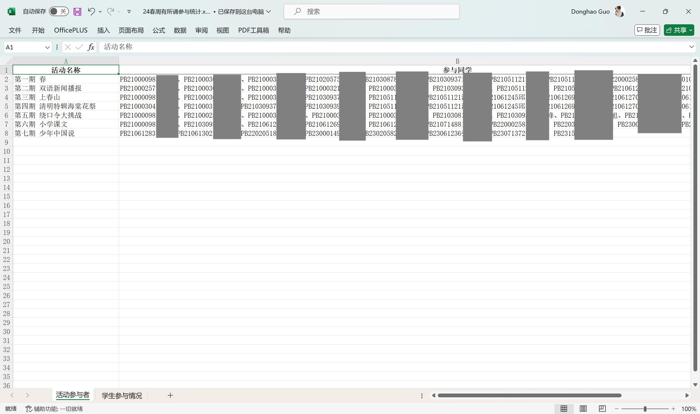
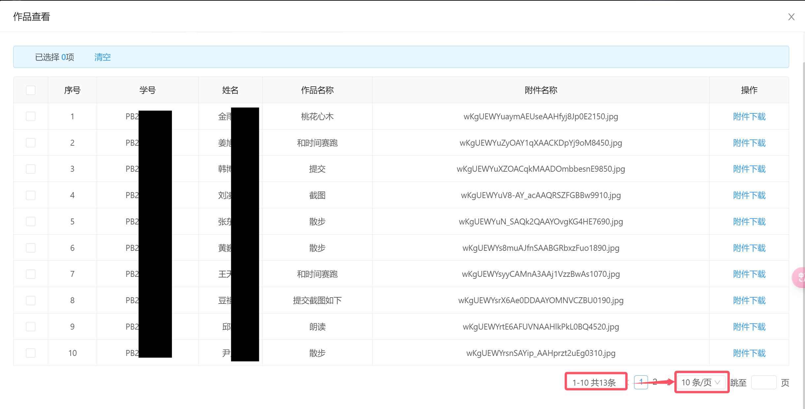

## USTC第二课堂系列活动参与情况统计脚本说明 - tool.py
中国科学技术大学
校学生主持人俱乐部
郭东昊
2024.8.25
> 这个Python脚本用于提交作品类系列活动（作品格式只能是jpg或png）统计学生参与活动的情况，并将结果输出到Excel文件中。

### 使用须知
- 本程序适合中科大学生社团负责人统计提交作品类系列活动的参与情况
- 使用本程序，需要您掌握一定的python知识
- 提交作品的格式仅限于`jpg` `png`这两类图片格式
- 使用本程序，需要您**手动从二课系统上批量导出作品并按照一定的规则将它们重命名并放在指定名称的目录下**，在[使用方法](#使用方法)会进行详述

### 效果展示
程序输出一个excel表格，包含两个工作表
- **活动参与者**：按照顺序输出**每个活动的参与者信息**，参与者按学号升序排序

- **学生参与情况**：按照学号顺序输出每个学生参与活动的**次数**和**参与的具体活动名称**，后者按活动期号数升序排序


### 目录结构介绍
```
│  readme.md············本文档
│  tool.py··············脚本文件
│  
├─data··················空目录，用于放置需要被处理的二课系统导出的数据
└─img···················本文档引用的图片
```

### 项目依赖
请确保你的Python环境已经安装了以下库。你可以通过以下命令来安装它们：

```sh
pip install os re pandas openpyxl
```

### 使用方法
1. **从二课系统导出作品**
   - 进入二课系统，依次点击：项目总结 -> 子项目 -> 作品查看 -> 全选所有学生 -> 批量下载作品。
   - 如果这一期活动参与人数超过10人，需要调整每页显示条数，以确保一次全选能选中所有参与本期活动的同学。
   

2. **解压缩并重命名目录**
   - 从青春科大上导出的作品压缩包默认名称为`作品提交.zip`。
   - 解压缩这个压缩包后，重命名目录名称为`第X期 该活动名称`，其中X为汉字数字，代码支持一到二十。
   - 按照以上方法导出、解压缩、重命名后，将它们放到一个名为[`data`]的目录下，目录格式如下：
   ```
   data
   ├─第一期 《匆匆》
   ├─第七期 雪
   ├─第三期 《有的人》
   ├─第九期 新年特辑
   ├─第二期 《满江红》&《兵车行》
   ├─第五期 我诵秋声
   ├─第八期 人民万岁
   ├─第六期 铭记历史，勿忘国耻
   └─第四期 《谁是最可爱的人》
   ```

3. **运行脚本**
   - 将tool.py放置得与data目录**同级**
   - 打开命令行或终端，导航到包含`tool.py`脚本的目录。
   - 运行以下命令：
   ```sh
   python tool.py
   ```

4. **查看结果**
   - 脚本运行完成后，会生成一个名为`output.xlsx`的Excel文件。
   - 打开`output.xlsx`文件，查看统计结果。

### 注意事项
- 确保你的Python环境已经安装了`os` `re` `pandas` `openpyxl`这些库。
- 如果在运行过程中遇到问题，请检查是否按照上述步骤正确操作。